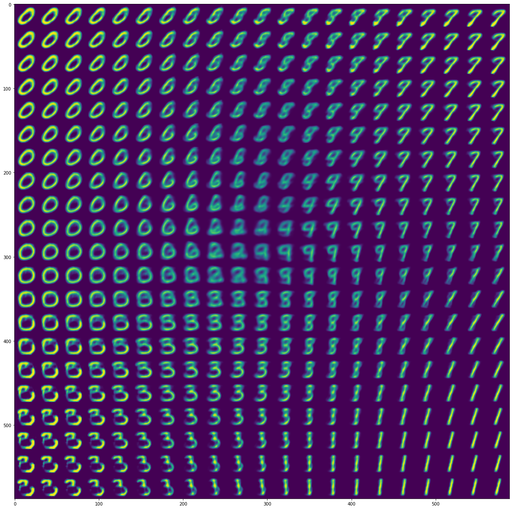

# Variational Autoencoders

The documentation is [here](http://penkovsky.com/neural-networks/day9).

## How To Run

Download MNIST data

    ./download.sh

Install [Hasktorch](https://github.com/hasktorch/hasktorch/). I typically run a
Docker container and connect to a terminal:

    docker run --gpus all -it --rm -p 8888:8888 \
      -v "$(pwd):/home/ubuntu/workspace" htorch/hasktorch-jupyter:latest-cu11

    docker exec -it CONTAINER_NAME bash
    cd workspace/

Hint: To identify the container's name you may want to run `docker ps`.

Build

    ghc -O2 vae.hs

Run

   ./vae 1
